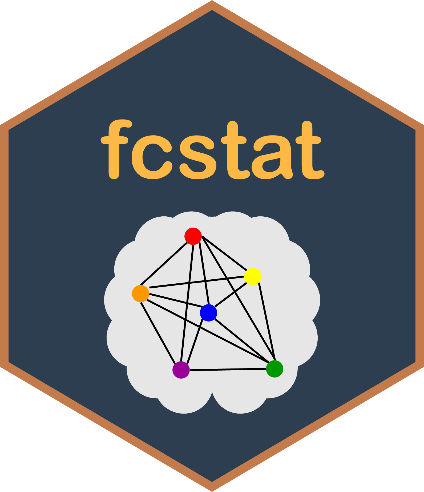

# fcstat 

<!-- badges: start -->
[](https://github.com/Carol-seven/fcstat/actions/workflows/R-CMD-check.yaml)
<!-- badges: end -->

The goal of **fcstat** is to provide classical statistical methods for estimating
functional connectivity analysis in brain networks, making them user-friendly
and useful for researchers and practitioners in the field of neuroimaging.

## Installation

You can install the development version of **fcstat** from
[GitHub](https://github.com/) with:

``` r
# install.packages("devtools")
devtools::install_github("Carol-seven/fcstat")
```
